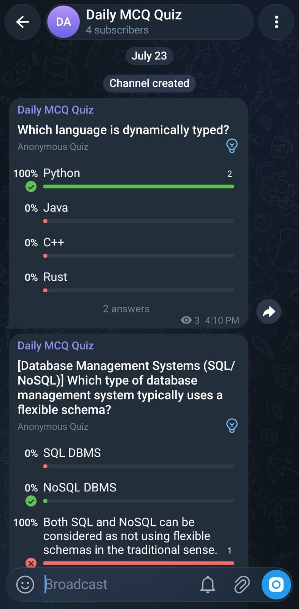

# 🧠 MCQ Challenge App

<p align="center">
  <strong>AI-powered MCQ Generator with Automatic Telegram Quiz Polls</strong>
</p>

<p align="center">
  
  
  
  
  
  
</p>

An AI-powered quiz application that automatically generates high-quality Computer Science multiple-choice questions using **Ollama**, serves them through a responsive web interface, and publishes every new question as a native **Telegram Quiz Poll**.

---

## 📸 Preview

<p align="center">
  
</p>

---

## ✨ Features

* 🤖 AI-generated MCQs powered by **Ollama**
* 📚 Covers multiple Computer Science subjects
* 🔄 Automatically generates fresh quiz questions
* 📲 Publishes every question as a native Telegram Quiz Poll
* 🔒 Secure server-side answer validation
* 🏆 Score, streak, and best streak tracking
* 🌙 Clean, responsive dark-themed interface
* ⚡ Ready for production deployment with PM2

---

## 📚 Topics Covered

Questions are generated across various Computer Science domains, including:

* Object-Oriented Programming
* Data Structures
* Algorithms
* Operating Systems
* Computer Networks
* Database Management Systems
* System Design
* Git & GitHub
* Web Development
* Software Testing
* Cyber Security
* Cloud Computing
* Linux
* Programming Fundamentals
* General Computer Science Concepts

---

## 🛠️ Tech Stack

| Layer      | Technology                       |
| ---------- | -------------------------------- |
| Backend    | Node.js, Express.js              |
| Frontend   | HTML, CSS, JavaScript            |
| AI Model   | Ollama (`qwen2.5:7b` by default) |
| Scheduler  | node-cron                        |
| Messaging  | Telegram Bot API                 |
| Deployment | PM2                              |

---

## 📁 Project Structure

```text
telegram-mcq-bot/
├── assets/
│   └── MCQ-Quiz.jpeg
├── public/
│   └── index.html
├── generateMCQ.js
├── telegram.js
├── server.js
├── ecosystem.config.js
├── .env.example
├── .gitignore
├── package.json
├── package-lock.json
├── LICENSE
└── README.md
```

---

# 🚀 Getting Started

## Prerequisites

Before running the project, make sure you have installed:

* Node.js (v16 or later)
* npm
* Ollama

Install Ollama from:

https://ollama.com/download

---

## 1. Clone the Repository

```bash
git clone https://github.com/dhruvil0203/telegram-mcq-bot.git
cd telegram-mcq-bot
```

---

## 2. Install Dependencies

```bash
npm install
```

---

## 3. Download the AI Model

```bash
ollama pull qwen2.5:7b
```

You can use any compatible Ollama model by changing the environment variable.

---

## 4. Configure Environment Variables

Copy the example file:

```bash
cp .env.example .env
```

Edit `.env` and configure your values.

Example:

```env
PORT=5000

OLLAMA_MODEL=qwen2.5:7b

TELEGRAM_BOT_TOKEN=YOUR_BOT_TOKEN

TELEGRAM_CHAT_ID=@your_channel
```

---

## 5. Start Ollama

```bash
ollama serve
```

---

## 6. Run the Application

```bash
npm start
```

Open your browser:

```
http://localhost:5000
```

---

# 🤖 Telegram Bot Setup

To enable automatic Telegram Quiz Polls:

### 1. Create a Bot

Open Telegram and search for **@BotFather**.

Create a new bot and copy the generated Bot Token.

---

### 2. Create or Choose a Channel

Create a Telegram channel (or use an existing one).

---

### 3. Add Your Bot

Add the bot as an **Administrator** of the channel.

Make sure it has permission to post messages.

---

### 4. Configure Environment Variables

```env
TELEGRAM_BOT_TOKEN=YOUR_BOT_TOKEN
TELEGRAM_CHAT_ID=@your_channel
```

If Telegram credentials are not provided, the application will continue working normally and simply skip sending quiz polls.

---

# 🌟 What the Application Does

The application automatically:

* Generates a new Computer Science MCQ using Ollama.
* Stores the latest generated question.
* Displays the question on a web interface.
* Validates answers securely on the server.
* Tracks the user's score and streak.
* Publishes every newly generated question as a Telegram Quiz Poll.

---

# 📦 Production

For production deployment, PM2 is recommended.

```bash
npm install -g pm2

pm2 start ecosystem.config.js

pm2 save
```

---

# 🤝 Contributing

Contributions, issues, and feature requests are welcome.

If you'd like to improve the project:

1. Fork the repository.
2. Create a new branch.
3. Commit your changes.
4. Push your branch.
5. Open a Pull Request.

---

# ⭐ Support

If you found this project useful, consider giving it a ⭐ on GitHub.

Repository:

**https://github.com/dhruvil0203/telegram-mcq-bot**

---

# 📄 License

This project is licensed under the **MIT License**.

See the **LICENSE** file for more information.
